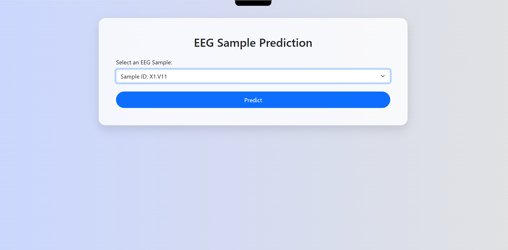
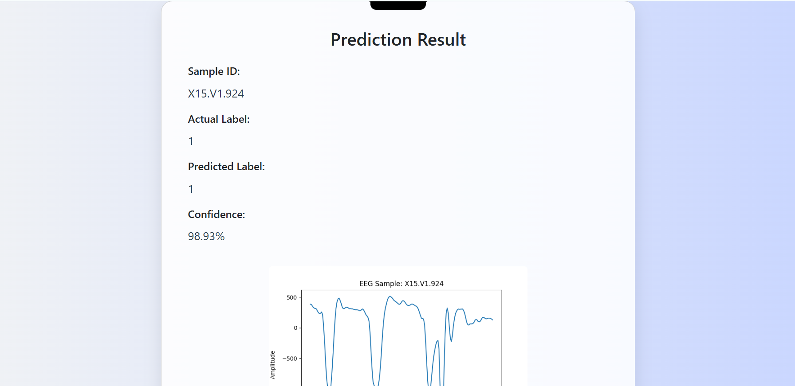

# 🧠 Epileptic Seizure Detection using CNN


A deep learning-based web application that detects epileptic seizures from EEG data using a Convolutional Neural Network (CNN) and provides predictions with confidence scores on a sleek, user-friendly interface.

---

## 📸 Screenshots

<p align="center">
  
  <br/>
  
</p>

---

## 💡 Features

- 🚀 **Real-time EEG prediction** via CNN model
- 🧠 Detects seizure and non-seizure states from EEG features
- 📊 Displays confidence score and actual vs predicted results
- 📈 Plots EEG signals with dynamic graph
- 💻 Responsive Flask + Bootstrap-based frontend
- 🧪 Simple UI to test trained deep learning models

---

## 🚀 How to Run Locally

```bash
# 1. Clone the repository
git clone https://github.com/your-username/Epileptic-Seizure-Detection.git
cd Epileptic-Seizure-Detection

# 2. Create a virtual environment
python -m venv venv
# Windows
venv\Scripts\activate
# macOS/Linux
source venv/bin/activate

# 3. Install dependencies
pip install -r requirements.txt

# 4. Run the Flask app
python app.py

📦 Deployment
⚠️ Recommended Platforms for Flask:
Render

Railway

Heroku (legacy support)

🧪 Sample Prediction
Sample ID  	Actual Label  	Predicted Label  	Confidence
1124	        Seizure        Seizure	           94.8%
1022      	No Seizure	      No Seizure         98.1%

🛠️ Tech Stack
🐍 Python 3.10

🔥 TensorFlow / Keras

🌐 Flask (Python Web Framework)

🎨 HTML5 + CSS3 + Bootstrap 5

📉 Matplotlib for plotting EEG data

🧹 Git & GitHub for version control

📂 Project Structure
├── app.py
├── train_model.py
├── model/
│   └── seizure_model.h5
├── templates/
│   ├── index.html
│   └── result.html
├── static/
│   └── plot.png
├── uploads/
│   └── eeg_data.csv
├── screenshots/
│   ├── homepage.png
│   └── prediction.png
├── .env
├── .gitignore
├── requirements.txt
└── README.md


👨‍💻 Contributors
Shivani – Developer & ML Engineer
contact - shivani030303@gmail.com


🤍 Special Thanks
To all the researchers and contributors in the field of Epileptic Seizure Detection and EEG Data Science.

⭐ If you like this project, give it a star and consider contributing!
